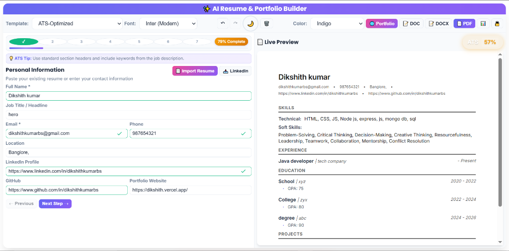

# 🚀 AI Resume & Portfolio Builder

**Live Demo:** [https://ai-res-port.vercel.app/](https://ai-res-port.vercel.app/)

A powerful, privacy-first tool that helps students and professionals create ATS-optimized resumes and portfolio websites in minutes using Generative AI.

## ✨ Key Features

*   **🤖 AI-Powered Content Generation:**
    *   Automatically generates professional summaries.
    *   Rewrites bullet points using the STAR method (Situation, Task, Action, Result).
*   **📄 Smart Resume Parsing:**
    *   Import existing resumes (PDF/JSON) to auto-fill data.
    *   **Transcript Parser:** Extract courses and grades directly from academic transcripts.
*   **🎯 ATS Optimization:**
    *   Real-time scoring against industry standards.
    *   Keyword density analysis to beat Applicant Tracking Systems.
*   **🌐 Instant Portfolio Websites:**
    *   One-click generation of a personal website from your resume data.
*   **🔒 Privacy-First:**
    *   **Local Storage:** All data lives in your browser. No databases.
    *   **PII Masking:** Personal data is redacted before touching API services.

## 🛠️ Tech Stack

*   **Frontend:** HTML5, CSS3, Vanilla JavaScript (ES6+)
*   **AI Models:** Google Gemini Pro, Hugging Face
*   **Deployment:** Vercel

## � Getting Started

1.  Clone the repository.
2.  Open `index.html` in your browser.
3.  Start building your resume!
